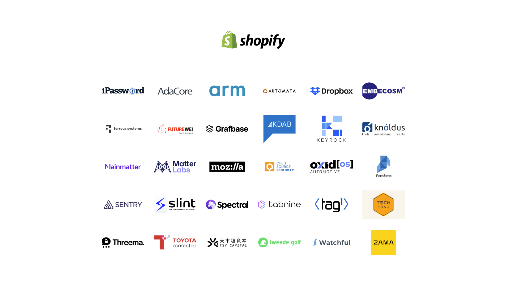

# What is Rust?

<style>
img[alt~="center"] {
  display: block;
  margin: 0 auto;
}
.columns {
    display: grid;
    grid-template-columns: repeat(2, minmax(0, 1fr));
    gap: 1rem;
}
</style>

## The 100-foot view

## A free and open-source __systems programming__ language

> A language empowering everyone to build reliable and efficient software.

## Hello, World

```rust
fn main() {
    println!("Hello, world!");
}
```

## You can build...

<div class="columns">
<div>

* Network Services
* Command-line Apps
* Web Apps
* Desktop Apps
* Bootloaders

</div>
<div>

* Device Drivers
* Hypervisors
* Embedded Systems
* Libraries/plugins for applications in other languages

</div>
</div>

## Front-end or Back-end?

* It's applicable at *every point* in the stack

## Fast

## Safe

## Productive

## It's increasingly popular!

* [Stack Overflow Most Loved Language](https://survey.stackoverflow.co/2022/#section-most-loved-dreaded-and-wanted-programming-scripting-and-markup-languages)

> Rust is on its seventh year as the most loved language with 87% of developers saying they want to continue using it.

## Cross-platform

* Windows, macOS, Linux
* iOS, Android, Web, Bare-metal, etc

## Portable

* Source code is portable across multiple architectures:
  * x86 and Arm
  * Power, MIPS, SPARC, ...

## Rust can *import* C-compatible libraries

* Want to use `zlib`, `OpenSSL`, `SomeSpecialDriverLib`? Sure!

## Rust can *export* C-compatible libraries

* Python extension modules? Ok!
* Android native libraries? No problem.
* Replace the file parser in your Very Large C++ Application? Can-do.
    * See [Firefox](https://wiki.mozilla.org/Oxidation)

## Where did Rust come from?

## A Little Bit of History

* Rust began around 2008
* An experimental project by Graydon Hoare
* Adopted by Mozilla
* Presented to the general public as version 0.4 in 2012

## Focus

* Rust lost many features from 2012 to 2014
  * garbage collector
  * evented runtime
  * complex error handling
  * etc
* Rust oriented itself towards being a usable systems programming language

## Development

* Always together with a larger project (e.g. Servo)
* Early adoption of regular releases
* RFC process
* Editions

## Public Release

* First 1.0 release in 2015
  * https://blog.rust-lang.org/2015/05/15/Rust-1.0.html
  * "This release is the official beginning of our commitment to stability"
* New release *every six weeks* since

## Who's in charge now?

## The Rust Foundation

> ... is an independent non-profit organization dedicated to stewarding the Rust
> programming language, nurturing the Rust ecosystem, and supporting the set of
> maintainers governing and developing the project.

---


---



## The Rust Project

https://www.rust-lang.org/governance

<div class="columns">
<div>

* Core Team          
* Compiler Team      
* Crates.io Team     
* Dev Tools Team     
* Infrastructure Team

</div>
<div>

* Language Team   
* Library Team    
* Moderation Team 
* Release Team    

</div>
</div>

## Working Groups

<div class="columns">
<div>

* Async WG
* Command-line Interface WG
* Embedded devices WG
* Game Development WG

</div>
<div>

* Rust by Example WG
* Secure Code WG
* Security Response WG
* WebAssembly (WASM) WG

</div>
</div>

## Who decides on new features?

* Discuss in chat/forums
* Open an RFC (a specification)
* Relevant team takes a vote
* Tracking ticket is created
* Pull Request(s) to implement the change
* Stabilisation

## Summary

* Rust is a collaborative open-source project that prides itself on inclusion.
* There is no "owner", nor "BDFL" 
* It has a strong financial backing
* It is a work in progress

## Is this a community I can engage with?

## A strong Code of Conduct

The Rust Project, and pretty much the whole Community, follow a [Code of
  Conduct](https://www.rust-lang.org/policies/code-of-conduct)

> We are committed to providing a friendly, safe and welcoming environment for
> all, regardless of level of experience, gender identity and expression, sexual
> orientation, disability, personal appearance, body size, race, ethnicity, age,
> religion, nationality, or other similar characteristic.

## A strong Code of Conduct

> Likewise any spamming, trolling, flaming, baiting or other attention-stealing behavior is not welcome.

* Builds on efforts in other communities

## Why?

* Because a community is only as strong as its members

> Going beyond technical points, Rust has a vibrant, welcoming community -
> ([Stackoverflow Blog](https://stackoverflow.blog/2020/01/20/what-is-rust-and-why-is-it-so-popular/))

## Why?

* If you allow both wolves *and* sheep into your space, you won't get any sheep
* The Rust Community seems to have a higher than average representation from the
  LGBTQI+ community

## So beginners are welcome?

* Absolutely!
* Relatively speaking, we're *all* still beginners
* You even see open tickets on the rust-lang Github marked as *E-easy: Good
  first issue*.

## This extends to the compiler's interface...

* Any Rust error message which is unclear or ambiguous...
* ... is considered a bug and will be fixed ...
* ... if you open a ticket (or tweet @ the right people)

## Compiler Error Driven Development works!

```
error[E0502]: cannot borrow `name` as mutable because it is also borrowed as immutable
 --> a.rs:4:5
  |
3 |     let nickname = &name[..3];
  |                     ---- immutable borrow occurs here
4 |     name.clear();
  |     ^^^^^^^^^^^^ mutable borrow occurs here
5 |     println!("Hello there, {}!", nickname);
  |                                  -------- immutable borrow later used here

For more information about this error, try `rustc --explain E0502`.
```

## What does Rust run on?

## Host vs Target

* The machine you develop on
* The machine the program runs on

## Rust is a cross-compiler

* It uses LLVM to generate machine code
* *Every* Rust install is a cross-compiler
  * No rummaging for extra installers for your platform

## Hosts

* Windows (__x86__, __x86-64__, Aarch64)
* macOS (__x86-64__, Aarch64)
* Linux (__x86__, __x86-64__, __Aarch64__, RISC-V, Arm v6, Arm v7, MIPS, PowerPC, S390x)
* FreeBSD, NetBSD, Illumos, ...

## Targets

* All of the above, plus...
* Bare-metal Embedded
* WebAssembly
* Android
* iOS/watchOS/tvOS
* UEFI
* Nintendo Switch, 3DS and GBA
* Sony Playstation and PS Vita
* Add your own!

## What does Rust cost?

## Rust is Open Source

* Under the MIT or Apache-2.0 licences
* You can compile `rustc` and `cargo` yourself
* https://github.com/rust-lang/rust

## Binaries are provided free of charge

* Available using the `rustup` tool
* AWS sponsor the project
* Nothing to sign, no USB dongle required

## Support is available

* There are lots of places you can go for help
  * Forums, Discord, Reddit
  * Professional consulting firms
* There will soon be a *premium* Rust compiler with a support contract

## No-one is an expert overnight

* Budget for some training
* Budget for some time for the team to gain experience
* (More on this later...)

## You might need a bigger computer...

> Today, compiling the __Rust compiler__ on a 4-core CPU, that is typically
> found in a standard laptop, takes up to 15 minutes with another 5-10 minutes
> for tests. However, a 96-core cloud virtual machine can complete the same
> build in less than five minutes with tests completing in 35 seconds.

## Compile time checks vs run-time checks

* Rust does a lot of work *up front*
* The faster your checks run, the more productive you are!
* Raspberry Pi 4 technically works, but it takes a while...

## Can I build safety-critical systems?

## Some terminology

* You *certify* that a *system* is safe/correct
* You usually elect to build that *system* using *qualified* components (like
  toolchains)
* *Quality* is the result of an ongoing process

## What is a safety-critical system?

Generally built following to a standard, like ISO 26262:

> ISO 26262 is intended to be applied to safety-related systems that include one
> or more electrical and/or electronic (E/E) systems and that are installed in
> series production passenger cars with a maximum gross vehicle mass up to 3500
> kg.

## What is a safety-critical system?

Generally built following to a standard, like ISO 26262:

> This document describes a framework for functional safety to assist the
> development of safety-related E/E systems. This framework is intended to be
> used to integrate functional safety activities into a company-specific
> development framework.

## And for other applications:

* __DO-178C__ *Software Considerations in Airborne Systems and Equipment
  Certification*
* __IEC 61508__ *Functional Safety of Electrical/Electronic/Programmable Electronic
  Safety-related Systems*
* __IEC 62278__ *Railway applications - Specification and demonstration of
  reliability, availability, maintainability and safety*
* __IEC 62034__ *Medical device software – Software life cycle processes*
* There are many others...

## Can I use Rust?

* Well you can use C
* And C is kinda risky...
* But processes have been developed to manage that risk
* And tools have been pre-qualified so you can rely on them doing what they say
  they are going to do

## Language Specifications

* C has *ISO/IEC 9899:2018* (C17)
* C++ has *ISO/IEC 14882:2020(E)* (C++20)
* Rust doesn't have a standard
  * The open-source compiler *is* the standard
  * The first ISO C standard (C90) came 17 years after C was invented, largely
    because there were a lot of different competing compilers

## Ferrocene

> Ferrocene will be an ISO26262 qualified version of the existing open-source
> compiler, `rustc`. Ferrocene will be first made available to customers in the
> ISO 26262 space, with others like DO-178C, IEC 61508 and IEC 62278 in mind.

## Ferrocene

* A Ferrous Systems and AdaCore joint venture
* To produce Ferrocene, they first wrote the *Ferrocene Language Specification*
  * See <https://spec.ferrocene.dev>
* Ferrocene is based on the open-source Rust compiler
  * Additional testing and run-time checks in the toolchain
  * Lots of documentation!
* Pricing and support options available in due course
