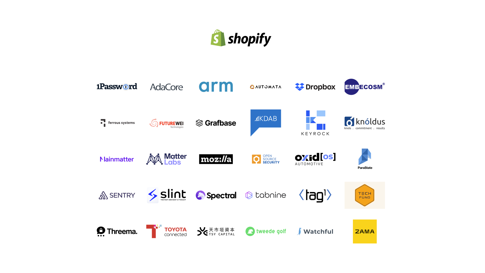

# Who's in charge now?

---

## The Rust Foundation

> ... is an independent non-profit organization dedicated to stewarding the Rust programming language, nurturing the Rust ecosystem, and supporting the set of maintainers governing and developing the project.

---

## Foundation Members

---

---

## The Rust Project

https://www.rust-lang.org/governance

* Core Team
* Compiler Team
* Crates.io Team
* Dev Tools Team
* Infrastructure Team

* Language Team
* Library Team
* Moderation Team
* Release Team

---

## Working Groups

* Async WG
* Command-line Interface WG
* Embedded devices WG
* Game Development WG

* Rust by Example WG
* Secure Code WG
* Security Response WG
* WebAssembly (WASM) WG

---

## Who decides on new features?

* Discuss in chat/forums
* Open an RFC (a specification)
* Relevant team takes a vote
* Tracking ticket is created
* Pull Request(s) to implement the change
* Stabilisation

---

## Summary

* Rust is a collaborative open-source project that prides itself on inclusion.
* There is no "owner", nor "BDFL" 
* It has a strong financial backing
* It is a work in progress
